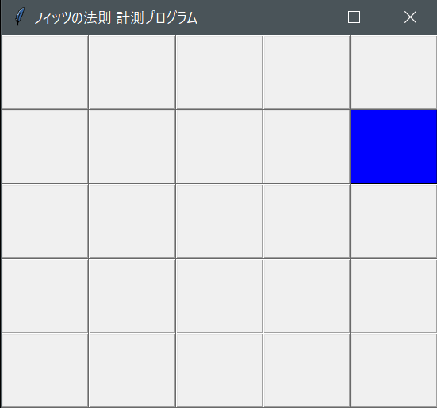
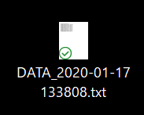

## はじめに
マウスのポインティングにもフィッツの法則（以下）  
$$
T=a\log_2\left(\frac{D}{W}+0.5\right)
$$
が適用できる（上式と微妙に異なる式が幾つか存在する．また，本来は1次元的な移動に関する法則である）．ここで，Tはポインティングに要する時間，Dは移動距離，Wはポインティング対象の領域の幅，aは定数である．この法則を実際に確かめるためには，マウスのクリックにかかる時間と移動開始，終了座標を記録すればよい．それを行うのが本プログラム．

## 使用例
```
> python fitts_analyze.py
```
でプログラムを実行し，色のついたボタンをなるべく早くクリックしていく．

実行例：  


ボタンの幅はデフォルトで10px（現在縦のピクセルについては正確な値ではない），ボタンの個数は5x5，総クリック回数は10となっているが，実行時に以下の引数を与えて，変更できる．  

|ボタンサイズ(px)|ボタンの個数(一辺)|総クリック回数|
|:---:|:---:|:---:|
|-b|-n|-c|
  
例えば，総クリック回数を100回にしたければ，以下となる．
```
> python fitts_analyze.py -c 100
```

計測終了後，以下のようなテキストファイルが出力される．  



中身は以下となる．
```
1579235875.1922972 Point(x=551, y=137) False
1579235879.0881064 Point(x=522, y=267) True
1579235880.0135968 Point(x=398, y=286) True
1579235881.2688231 Point(x=321, y=379) True
1579235882.1808178 Point(x=420, y=262) True
1579235883.2003698 Point(x=422, y=521) True
1579235884.1789615 Point(x=217, y=554) True
1579235885.1473994 Point(x=213, y=183) True
1579235886.1244318 Point(x=327, y=335) True
1579235887.1084855 Point(x=208, y=198) True
1579235888.0360487 Point(x=99, y=266) True
```

これは，クリックされた時のUNIX時間とその座標，そして正しいボタンがクリックされているかどうかが真偽値で示されている（最初のデータは初期条件を与えるもので，クリックは行われていないのでFalseとなっている）．これから，マウス移動の所要時間と移動距離が計算できることになる．